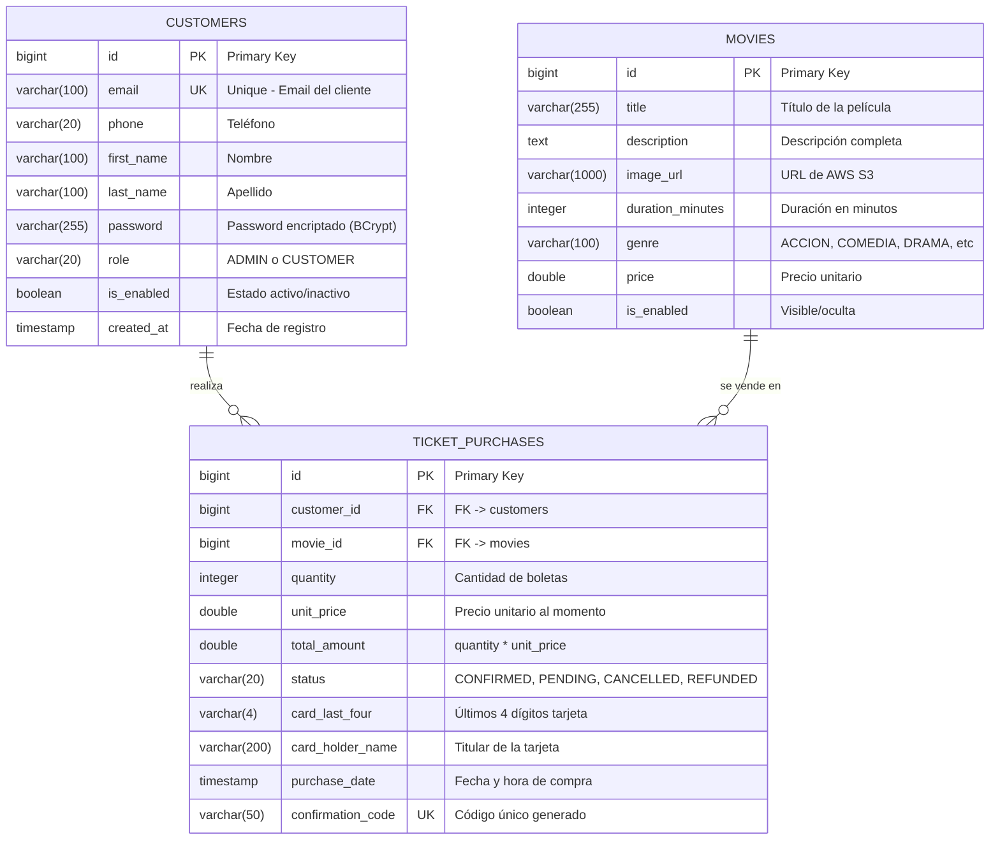

## Descripción de Relaciones

### CUSTOMERS → TICKET_PURCHASES (1:N)
- Un cliente puede realizar múltiples compras
- Cada compra pertenece a un único cliente
- Cascade: No eliminar cliente si tiene compras
- FK: `customer_id` → `customers.id`

### MOVIES → TICKET_PURCHASES (1:N)
- Una película puede tener múltiples ventas
- Cada compra es de una única película
- Cascade: No eliminar película si tiene ventas
- FK: `movie_id` → `movies.id`

## Índices para Optimización

```sql
-- CUSTOMERS
CREATE INDEX idx_customers_email ON customers(email);
CREATE INDEX idx_customers_enabled ON customers(is_enabled);
CREATE INDEX idx_customers_role ON customers(role);

-- MOVIES
CREATE INDEX idx_movies_enabled ON movies(is_enabled);
CREATE INDEX idx_movies_genre ON movies(genre);
CREATE INDEX idx_movies_enabled_genre ON movies(is_enabled, genre);

-- TICKET_PURCHASES
CREATE INDEX idx_purchases_customer ON ticket_purchases(customer_id);
CREATE INDEX idx_purchases_movie ON ticket_purchases(movie_id);
CREATE INDEX idx_purchases_date ON ticket_purchases(purchase_date);
CREATE INDEX idx_purchases_confirmation ON ticket_purchases(confirmation_code);
```

## Datos de Ejemplo

### Admin por defecto
```sql
INSERT INTO customers VALUES 
(1, 'admin@vortexbird.com', '3001234567', 'Admin', 'Sistema', 
'$2a$10$encrypted...', 'ADMIN', true, CURRENT_TIMESTAMP);
```

### Películas iniciales (6)
- Inception (ACCION)
- The Shawshank Redemption (DRAMA)
- The Dark Knight (ACCION)
- Pulp Fiction (CRIMEN)
- Forrest Gump (DRAMA)
- The Matrix (CIENCIA_FICCION)

### Clientes de ejemplo (6)
- Juan Pérez (CUSTOMER)
- María García (CUSTOMER)
- Carlos López (CUSTOMER)
- Ana Martínez (CUSTOMER)
- Luis Rodríguez (CUSTOMER)
- Sofia Hernández (CUSTOMER)

### Compras de ejemplo (7)
- Estados: CONFIRMED, PENDING
- Cantidades variadas (1-4 boletas)
- Códigos únicos: CONF-xxx-xxx
