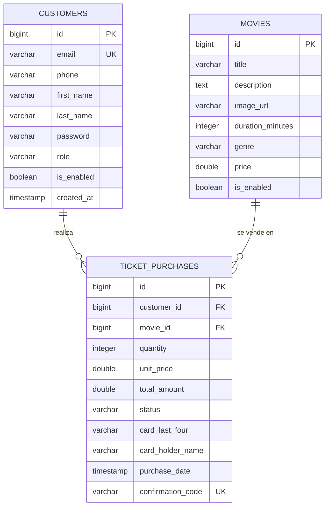

# 🎬 Sistema de Venta de Boletas de Cine - VortexBird

Sistema completo de gestión y venta de boletas para cine, desarrollado con **Spring Boot** (backend) y **Angular 17** (frontend).

## 📋 Tabla de Contenidos

- [Arquitectura](#-arquitectura)
- [Tecnologías](#-tecnologías)
- [Modelo de Datos](#-modelo-de-datos)
- [Estructura del Proyecto](#-estructura-del-proyecto)
- [Configuración y Ejecución](#-configuración-y-ejecución)
- [Funcionalidades Principales](#-funcionalidades-principales)
- [API Endpoints](#-api-endpoints)
- [Seguridad y Guards](#-seguridad-y-guards)
- [Testing](#-testing)

---

## 🏗️ Arquitectura

El sistema utiliza una arquitectura de **3 capas** con separación clara de responsabilidades:

```
┌─────────────────────────────────────────────────┐
│            FRONTEND (Angular 17)                │
│  - Standalone Components                        │
│  - Guards (admin, customer)                     │
│  - Services (HTTP)                              │
│  - Reactive Programming (RxJS)                  │
└─────────────┬───────────────────────────────────┘
              │ HTTP/REST API
┌─────────────▼───────────────────────────────────┐
│          BACKEND (Spring Boot 3.2.0)            │
│  ┌──────────────────────────────────────────┐   │
│  │  Controllers (REST Endpoints)            │   │
│  └──────────┬───────────────────────────────┘   │
│  ┌──────────▼───────────────────────────────┐   │
│  │  Services (Business Logic)               │   │
│  │  - Validation                            │   │
│  │  - Email Notifications (@Async)          │   │
│  │  - AWS S3 Integration                    │   │
│  └──────────┬───────────────────────────────┘   │
│  ┌──────────▼───────────────────────────────┐   │
│  │  Repositories (JPA/Hibernate)            │   │
│  └──────────┬───────────────────────────────┘   │
└─────────────┼───────────────────────────────────┘
              │
┌─────────────▼───────────────────────────────────┐
│         DATABASE (PostgreSQL 15)                │
│  - customers                                    │
│  - movies                                       │
│  - ticket_purchases                             │
│  - 9 indexes para optimización                  │
└─────────────────────────────────────────────────┘

┌─────────────────────────────────────────────────┐
│          CLOUD STORAGE (AWS S3)                 │
│  - Almacenamiento de imágenes                   │
│  - Bucket: vortexbird-movie-images              │
│  - Región: us-east-2                            │
└─────────────────────────────────────────────────┘
```

---

## 🛠️ Tecnologías

### Backend
- **Java 17** - Lenguaje principal
- **Spring Boot 3.2.0** - Framework web
- **Spring Data JPA** - ORM
- **PostgreSQL 15** - Base de datos
- **Spring Mail** - Envío de emails (Gmail SMTP)
- **AWS S3 SDK 2.20.26** - Almacenamiento cloud
- **Lombok** - Reducción de boilerplate
- **Maven** - Gestión de dependencias
- **JUnit 5 + Mockito** - Testing

### Frontend
- **Angular 17** - Framework SPA
- **TypeScript** - Lenguaje
- **Bootstrap 5** - Estilos base
- **RxJS** - Programación reactiva
- **Standalone Components** - Arquitectura modular
- **Jasmine + Karma** - Testing

### DevOps
- **Docker & Docker Compose** - Contenedorización
- **GitHub Actions** - CI/CD automático
- **nginx** - Servidor web para frontend

---

## 🗄️ Modelo de Datos

### Diagrama ER



### Relaciones

- **customers → ticket_purchases**: Un cliente puede realizar múltiples compras (1:N)
- **movies → ticket_purchases**: Una película puede tener múltiples ventas (1:N)

### Índices para Optimización

```sql
-- Búsqueda y autenticación
idx_customers_email
idx_customers_enabled
idx_customers_role

-- Películas
idx_movies_enabled
idx_movies_genre
idx_movies_enabled_genre

-- Compras
idx_purchases_customer
idx_purchases_movie
idx_purchases_date
idx_purchases_confirmation
```

---

## 📁 Estructura del Proyecto

```
PruebaTecnicaVortexBird/
├── backend/
│   └── src/main/java/com/vortexbird/movieticket/
│       ├── controller/           # REST Controllers
│       │   ├── CustomerController.java
│       │   ├── MovieController.java
│       │   └── TicketPurchaseController.java
│       ├── service/             # Lógica de negocio
│       │   ├── impl/
│       │   │   ├── CustomerService.java
│       │   │   ├── MovieService.java
│       │   │   ├── TicketPurchaseService.java
│       │   │   ├── S3StorageService.java
│       │   │   └── EmailService.java
│       │   ├── ICustomerService.java
│       │   ├── IMovieService.java
│       │   ├── ITicketPurchaseService.java
│       │   └── IStorageService.java
│       ├── repository/          # JPA Repositories
│       │   ├── ICustomerRepository.java
│       │   ├── IMovieRepository.java
│       │   └── ITicketPurchaseRepository.java
│       ├── dto/                 # Data Transfer Objects
│       ├── model/               # Entidades JPA
│       │   ├── Customer.java
│       │   ├── Movie.java
│       │   └── TicketPurchase.java
│       ├── config/              # Configuraciones
│       │   ├── SecurityConfig.java
│       │   ├── S3Config.java
│       │   └── AsyncConfig.java
│       └── shared/              # Clases compartidas
│           ├── ApiResponse.java
│           ├── GlobalExceptionHandler.java
│           └── exceptions/
│
├── frontend/src/app/
│   ├── core/                    # Servicios core
│   │   ├── services/
│   │   │   ├── auth.service.ts
│   │   │   ├── customer.service.ts
│   │   │   ├── movie.service.ts
│   │   │   ├── ticket-purchase.service.ts
│   │   │   └── storage.service.ts
│   │   ├── guards/
│   │   │   ├── admin.guard.ts
│   │   │   └── customer.guard.ts
│   │   └── interceptors/
│   │       └── error.interceptor.ts
│   ├── modules/                 # Módulos funcionales
│   │   ├── auth/               # Login & Registro
│   │   ├── home/               # Página principal
│   │   ├── movies/             # Gestión de películas
│   │   ├── customer/           # Gestión de clientes
│   │   ├── purchase/           # Compras
│   │   └── nav-bar/            # Barra de navegación
│   ├── shared/models/          # Modelos TypeScript
│   └── app.routes.ts           # Configuración de rutas
│
├── init.sql                     # Script de inicialización DB
├── docker-compose.yml           # Orquestación de contenedores
└── .github/workflows/ci.yml     # CI/CD Pipeline
```

---

## 🚀 Configuración y Ejecución

### Prerrequisitos

- Docker Desktop instalado
- Variables de entorno configuradas

### Variables de Entorno Requeridas

```env
# Database
POSTGRES_USER=postgres
POSTGRES_PASSWORD=yourpassword
POSTGRES_DB=movieticket

# AWS S3
AWS_S3_BUCKET_NAME=vortexbird-movie-images
AWS_S3_REGION=us-east-2
AWS_ACCESS_KEY_ID=your-access-key
AWS_SECRET_ACCESS_KEY=your-secret-key

# Email
MAIL_USERNAME=your-email@gmail.com
MAIL_PASSWORD=your-app-password
MAIL_FROM=your-email@gmail.com
```

### Ejecutar con Docker

```bash
# 1. Clonar el repositorio
git clone https://github.com/EstefanyCastro/PruebaTecnicaVortexBird.git
cd PruebaTecnicaVortexBird

# 2. Crear archivo .env con las variables
# Editar .env con tus credenciales

# 3. Levantar todos los servicios
docker-compose up --build

# La aplicación estará disponible en:
# - Frontend: http://localhost:4200
# - Backend API: http://localhost:8080
# - PostgreSQL: localhost:5432
```

### Usuario Administrador por Defecto

```
Email: admin@vortexbird.com
Password: Admin123!
```

---

## ✨ Funcionalidades Principales

### 👥 Para Clientes (CUSTOMER)

1. **Registro y Login**
   - Validación de email único
   - Encriptación de contraseñas (BCrypt)
   - Sesión persistente (localStorage)

2. **Exploración de Películas**
   - Visualización de catálogo
   - Filtros por género
   - Búsqueda por título
   - Detalles completos

3. **Compra de Boletas**
   - Selección de cantidad
   - Cálculo automático de total
   - Validación de tarjeta
   - Código de confirmación único
   - Email de confirmación automático

4. **Mis Compras**
   - Historial personal
   - Estados: CONFIRMED, PENDING, CANCELLED, REFUNDED
   - Búsqueda por código de confirmación

### 👨‍💼 Para Administradores (ADMIN)

1. **Gestión de Películas**
   - Crear/Editar/Deshabilitar
   - Upload de imágenes a AWS S3
   - Búsqueda por título
   - Paginación

2. **Gestión de Clientes**
   - Visualización completa
   - Habilitar/Deshabilitar
   - Búsqueda por nombre/email
   - Filtros y paginación

3. **Gestión de Compras**
   - Vista global de todas las ventas
   - Filtros por: película, cliente, estado
   - Estadísticas de ingresos y tickets vendidos
   - Búsqueda por código de confirmación

---

## 🔌 API Endpoints

### 🎬 Movies

```http
GET    /api/movies                    # Listar todas
GET    /api/movies/{id}               # Obtener por ID
GET    /api/movies/search             # Buscar (title, genre)
POST   /api/movies                    # Crear (multipart/form-data)
PUT    /api/movies/{id}               # Actualizar (multipart/form-data)
PUT    /api/movies/{id}/disable       # Habilitar/Deshabilitar
```

### 👤 Customers

```http
GET    /api/customers                 # Listar todos
GET    /api/customers/{id}            # Obtener por ID
POST   /api/customers/register        # Registro
POST   /api/customers/login           # Login
PUT    /api/customers/{id}            # Actualizar
PUT    /api/customers/{id}/disable    # Habilitar/Deshabilitar
```

### 🎟️ Ticket Purchases

```http
GET    /api/ticket-purchases/customer/{customerId}  # Compras por cliente
GET    /api/ticket-purchases/movie/{movieId}        # Compras por película
GET    /api/ticket-purchases/{confirmationCode}     # Por código
POST   /api/ticket-purchases                        # Crear compra
```

## 🔐 Seguridad y Guards

### Backend - Security Config

```java
@Configuration
@EnableWebSecurity
public class SecurityConfig {
    @Bean
    public SecurityFilterChain filterChain(HttpSecurity http) {
        return http
            .csrf().disable()
            .authorizeHttpRequests(auth -> auth.anyRequest().permitAll())
            .build();
    }
}
```

**Nota**: Actualmente permite todo el tráfico para desarrollo. En producción se debe implementar JWT.

### Frontend - Route Guards

#### Admin Guard
```typescript
export const adminGuard: CanActivateFn = (route, state) => {
  const authService = inject(AuthService);
  const router = inject(Router);

  if (authService.isAdmin()) {
    return true;
  }

  router.navigate(['/home']);
  return false;
};
```

#### Customer Guard
```typescript
export const customerGuard: CanActivateFn = (route, state) => {
  const authService = inject(AuthService);
  const router = inject(Router);

  if (authService.isCustomer()) {
    return true;
  }

  router.navigate(['/home']);
  return false;
};
```

### Rutas Protegidas

```typescript
// Solo Admin
{ path: 'admin/customers', canActivate: [adminGuard] }
{ path: 'admin/purchases', canActivate: [adminGuard] }
{ path: 'movies/manage', canActivate: [adminGuard] }

// Solo Customer
{ path: 'customer/purchases', canActivate: [customerGuard] }
{ path: 'purchase/:id', canActivate: [customerGuard] }
```

---

## 🧪 Testing

### Backend Tests

```bash
cd backend
mvn clean test

# Ejecutar con cobertura
mvn clean test jacoco:report
```

**Cobertura**: 89 tests, todos pasando ✅

### Frontend Tests

```bash
cd frontend
npm test

# Con cobertura
npm test -- --code-coverage
```

### CI/CD - GitHub Actions

El proyecto incluye workflow automático que ejecuta en cada push:

1. **Backend Tests**: Maven + JUnit
2. **Frontend Tests**: Karma + Jasmine
3. **Build Check**: Compilación de ambos proyectos

Ver: `.github/workflows/ci.yml`

---

## 📧 Email Notifications

El sistema envía emails automáticamente mediante **Spring Mail + Gmail SMTP**:

### Configuración

```yaml
spring:
  mail:
    host: smtp.gmail.com
    port: 587
    username: ${MAIL_USERNAME}
    password: ${MAIL_PASSWORD}  # App Password
    properties:
      mail.smtp.auth: true
      mail.smtp.starttls.enable: true
```

### Eventos que disparan emails

- ✅ **Compra confirmada**: Detalles + código de confirmación

### Ejecución Asíncrona

```java
@Async
public void sendPurchaseConfirmation(TicketPurchase purchase) {
    // Envío no bloqueante
}
```

---

## ☁️ AWS S3 Integration

### Configuración

```java
@Configuration
public class S3Config {
    @Bean
    public S3Client s3Client() {
        return S3Client.builder()
            .region(Region.US_EAST_2)
            .credentialsProvider(
                StaticCredentialsProvider.create(
                    AwsBasicCredentials.create(accessKey, secretKey)
                )
            )
            .build();
    }
}
```

### Validaciones

- **Tamaño máximo**: 5 MB
- **Tipos permitidos**: JPEG, JPG, PNG, GIF, WEBP
- **Nombres únicos**: UUID + extensión original
- **Ruta**: `movies/{uuid}.{extension}`

### URLs Generadas

```
https://vortexbird-movie-images.s3.us-east-2.amazonaws.com/movies/abc-123.jpg
```

---

## 📊 Base de Datos

### Inicialización

El archivo `init.sql` crea:
- 3 tablas principales
- 9 índices para optimización
- 1 usuario admin
- 6 películas de ejemplo
- 6 clientes de ejemplo
- 7 compras de ejemplo

### Conexión

```
Host: localhost
Port: 5432
Database: movieticket
User: postgres
Password: [ver .env]
```

---

## 🎨 Estilos Globales

El frontend utiliza **CSS Variables** centralizadas en `styles.css`:

```css
:root {
  --primary-gradient: linear-gradient(135deg, #667eea 0%, #764ba2 100%);
  --primary-color: #667eea;
  --secondary-color: #6c757d;
  --success-color: #28a745;
  --danger-color: #dc3545;
  --warning-color: #ffc107;
  --text-dark: #333;
  --text-muted: #6c757d;
  --border-color: #e0e0e0;
  --border-radius: 10px;
  --transition: all 0.3s ease;
}
```

Componentes individuales solo contienen estilos específicos.

---

## 🐛 Troubleshooting

### Backend no inicia

```bash
# Verificar que el puerto 8080 esté libre
netstat -ano | findstr :8080

# Verificar logs
docker-compose logs backend
```

### Frontend no compila

```bash
# Limpiar node_modules
rm -rf node_modules package-lock.json
npm install

# Verificar versión de Node (debe ser 20+)
node --version
```

### Email no se envía

- Verificar que `MAIL_PASSWORD` sea **App Password** de Gmail (no contraseña normal)
- Habilitar "Aplicaciones menos seguras" en cuenta de Gmail
- Verificar logs: `docker-compose logs backend | grep Email`

### Imágenes no se suben a S3

- Verificar credenciales AWS en `.env`
- Verificar permisos del bucket (debe permitir `s3:PutObject`)
- Bucket policy debe permitir lectura pública para las imágenes

---

## 📝 Licencia

Este proyecto fue desarrollado como prueba técnica para **VortexBird**.

---

## 👨‍💻 Autor

**Estefany Castro**
- GitHub: [@EstefanyCastro](https://github.com/EstefanyCastro)

---

## 📞 Soporte

Para dudas o problemas:
1. Abrir un issue en GitHub
2. Revisar los logs: `docker-compose logs`
3. Verificar variables de entorno en `.env`
